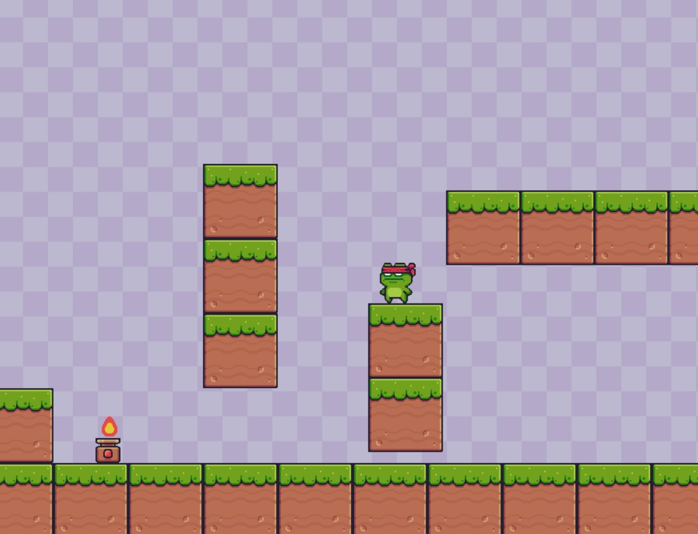

# Adventure-Game

### Description
Adventure Game is a platformer game developed using Python. It offers an engaging gameplay experience with pixel-perfect collisions, an animated character, single and double jumping mechanics, scrolling screens, and various game states. The game controls are straightforward: use the arrow keys to move and the space bar to jump.

### Game View

## How to Play
 - Use the arrow keys to move the character left, right, up and down.
 - Press the space bar to perform jumps. You can execute both single and double jumps.
 - Traverse through the platformer blocks, tactfully avoiding obstacles (fire).
 - Reach the end of block/path and jump off to end the game.

## Key Features
1. Dynamic Sprite & Image Loading: Uses 'os' module to automatically load sprite sheets and images without manual specification of file names.
2. Precise Collision Detection: Uses pixel masks for accurate collision detection between player and objects.
3. Background & Scrolling: Implements continuous background tiling and horizontal scrolling to follow player movement.
4. Player Animation: The code defines a Player class that handles the animation of the main character (NinjaFrog). Supports multi-directional animation for the player with various actions like idle, run, jump, and getting hit.
5. Player Jump & Gravity: Enable upward jumps with initial velocity (spacebar) and smooth descent due to gravity, enhancing gameplay dynamics. Implemented in the jump and loop methods of the Player class.
6. Game Over Condition: Detects player falling off the screen and displays "GAME OVER."

